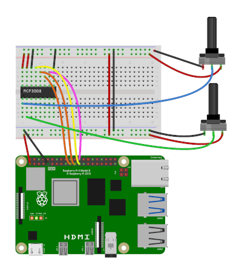

# Raspberry Pi Pong Video Game
Pong game for the Raspberry Pi using analogue inputs

## Introduction

This project is a video game based around a Raspberry Pi using an analogue to digital converter to read the positions of potentiometers.

## Wiring diagram

See the diagram below for details of how to wire up the controllers to the Raspberry Pi

## Install

Clone or download the files from the GitHub repository [GitHub RPI Pong](https://github.com/penguintutor/rpi-pong)

## Run the Game

For the basic black and white version run

    pgzrun pong.py
    
For the updatec colour version run

    pgzrun pong2.py
    
## More Information

For more details see: [PenguinTutor Raspberry Pi Pong video game project page](https://www.penguintutor.com/projects/pong) 